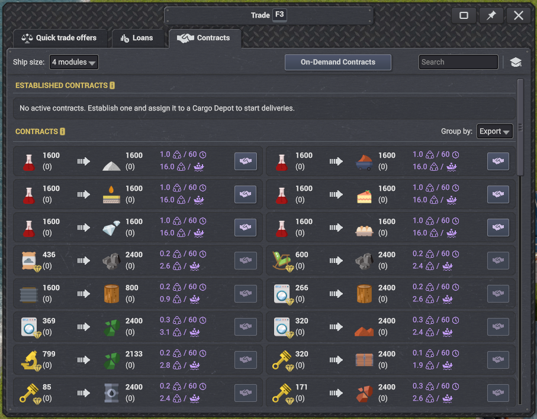
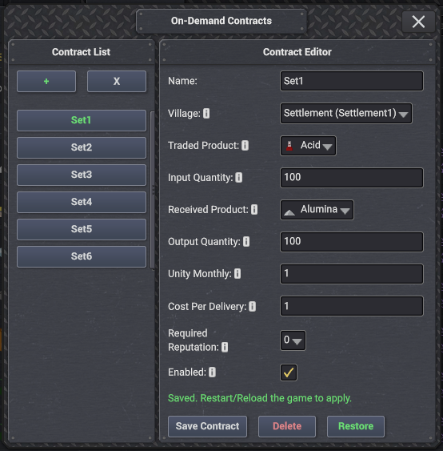
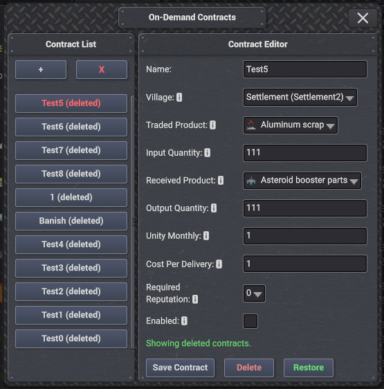

  <a href="https://hub.coigame.com/Mod/49/On-Demand-Contracts">
    <strong>⬇️ Download on COI Hub</strong>
  </a>

---

  

---

⚠️ Disclaimer: Use at your own risk.

• This mod interacts with save-critical data (contracts), and incorrect deletion or modification can break saves.

• I am not responsible for lost or corrupted saves.

• Always keep a backup of your saves if you plan to experiment.

---

📦 Adds a button inside the Contracts menu that lets you create your own custom world contracts.

---

⚙️ Customizable Parameters:

• 📥 Input & output products.

• 🔢 Quantities.

• 🏛️ Unity cost (monthly + scaling).

• ⭐ Required settlement reputation level.

➕ Click "+", set values, press Save, then reload your save after that the contract will appear in-game

---

⚠️ IMPORTANT – READ THIS
Contracts cannot be totally removed from saves because of serialization issues, only hidden (maybe possible but currently beyond my abilities), Therefore:

• 🗑️ Delete → moves contract to a backup file, it will not be loaded again until you restore it (it is hidden from the game contract list but not deleted)

• ✅ If your save still uses it → It will load normally, provided you do not delete or modify OnDemandContracts_deleted_backup.json

---

✅ Enable vs ❌ Delete

• ✅ Enabled toggle → hides the contract from the in-game list without removing it from the main contract list.

• ❌ Delete         → hides the contract from the in-game list while also removing it from the main contract list.

  Also Moves the contract to the backup file OnDemandContracts_deleted_backup.json.

---
🚫 DO NOT EDIT OR REMOVE JSON FILES

• ❌ Deleting JSON = broken save.
• ❌ Manually editing JSON = broken save.

---

# 📸 Screenshots:

<table>
<tr>
<td></td>
<td></td>
<td></td>
</tr>
</table>

---
